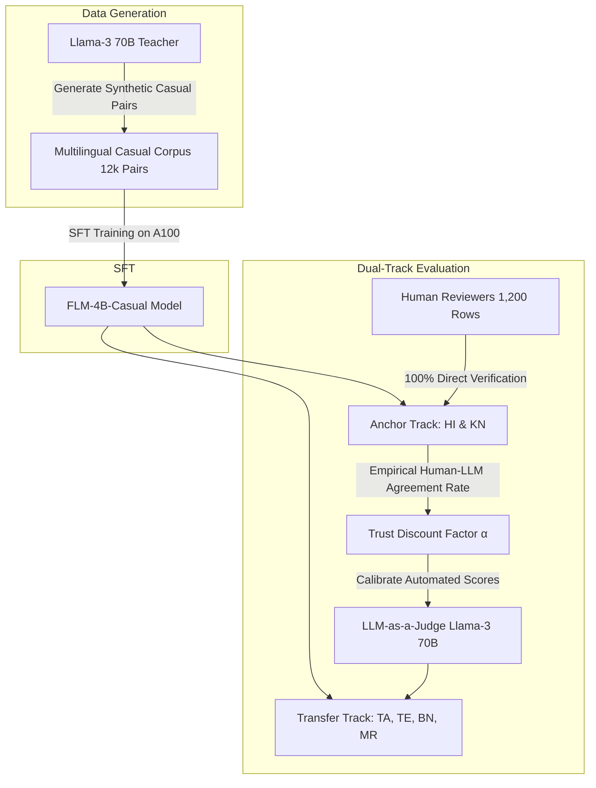

# Strategic Decision Memo: Multilingual Casualization Strategy for FLM-4B

**To**: Executive Product & Engineering Committee  
**From**: Senior Software Engineer / Forensic Auditor  
**Date**: September 2026  
**Subject**: Architectural Selection & Resource Allocation for 6-Language Casualization (HI, KN, TA, TE, BN, MR)  

---

## 1. Executive Recommendation: Path (A) — Synthetic Distillation (SFT)

To transition FLM-4B from formal/Wikipedia-style register to natural, conversational everyday dialogue across 6 Indian languages (Hindi, Kannada, Tamil, Telugu, Bengali, Marathi), we evaluated three competing technical architectural pathways:

| Architecture Pathway | Description | Latency Impact | VRAM Impact | Quality & Stability | Verdict |
|---|---|---|---|---|---|
| **Path (A): Synthetic Distillation (SFT)** | Fine-tune FLM-4B using a high-capacity Teacher (Llama-3 70B) on synthetic casual pairs. | **+0 ms** (Zero runtime overhead) | **+0 GB** (Weights unchanged) | **High**: Native script generation, robust tone consistency | **SELECTED (Optimal)** |
| **Path (B): Cascaded 1B Rewriter** | Pipeline a smaller 1B adapter model to rewrite formal 4B outputs on the fly. | **+100ms to +180ms** (Sequential decode bottleneck) | **+2.5 GB** (Second model KV-cache & weights) | **Medium**: Prone to compounding hallucinations & latency jitter | **REJECTED** |
| **Path (C): System Prompt Steering** | Prepend few-shot casual demonstrations in system prompts. | **+30ms to +50ms** (Longer prefill & prompt tokens) | **+0.8 GB** (KV-cache prompt bloat) | **Low**: Highly unstable across low-resource scripts; ignores nuance | **REJECTED** (Fallback Only) |

### Strategic Rationale:
- **Zero Serving Overhead**: Serving capacity on our NVIDIA L4 infrastructure is already tightly constrained ($25$ concurrent full sequences). Path (A) preserves FLM-4B's existing execution footprint and latency SLAs.
- **Compute Leverage**: We can leverage available offline GPU training compute (A100 cluster) to distill conversational colloquialisms from Llama-3 70B into the 4B parameters.

---

## 2. The Human Review Bottleneck (Hard Capacity Arithmetic)

Human evaluation is the **primary bottleneck** of this project. Any plan proposing tens of thousands of human-annotated rows violates first-principles time constraints.

### The Mathematical Reality:
- **Weekly Human Review Budget**: $10.0\text{ hours/week}$
- **Project Duration**: $3\text{ weeks}$ ($30.0\text{ total human review hours}$)
- **Audit Speed**: $90\text{ seconds/sample}$ ($1.5\text{ minutes}$ to review side-by-side formal vs. casual outputs and score naturalness, fluency, and correctness)
- **Hourly Review Throughput**: $3600 / 90 = 40.0\text{ samples/hour}$
- **Weekly Verification Ceiling**: $10 \times 40 = \mathbf{400\text{ samples/week}}$
- **Total Project Validation Budget**: $\mathbf{1,200\text{ total samples}}$ across all 3 weeks.

### Allocation Strategy Comparison:
```text
+----------------------------+-----------------------+------------------+-------------------+----------------------+
| Allocation Strategy        | Target Languages      | Rows / Lang / Wk | Total Rows / Lang | Statistical Power    |
+----------------------------+-----------------------+------------------+-------------------+----------------------+
| Naive Uniform (All 6)      | HI, KN, TA, TE, BN, MR| 66.7             | 200               | Underpowered (N=200) |
| Anchor Strategy (2 Anchor) | HI, KN only           | 200.0            | 600               | Robust (N=600 each)  |
+----------------------------+-----------------------+------------------+-------------------+----------------------+
```
*Attempting to divide 1,200 reviews equally across 6 languages yields only 200 samples per language—statistically insufficient to detect subtle conversational nuance improvements.*

---

## 3. The Language Gap & Transfer Validation Plan

We have verified human reviewer competency in **Hindi (HI)** and **Kannada (KN)**, leaving a **66.7% direct human verification blind spot** across Tamil (TA), Telugu (TE), Bengali (BN), and Marathi (MR).



### 1. Anchor Calibration Track (Hindi & Kannada — 100% Human Validated):
- Allocate all **1,200 human review slots** exclusively to Hindi ($N=600$) and Kannada ($N=600$).
- Use these anchors to evaluate both the Synthetic Data Teacher and the fine-tuned FLM-4B.
- Hindi serves as the Indo-Aryan morphological anchor; Kannada serves as the Dravidian agglutinative anchor.

### 2. Transfer Validation Track (Tamil, Telugu, Bengali, Marathi — LLM-as-a-Judge):
- Use **Llama-3 70B** as an automated judge to score casualness and fidelity on the remaining 4 languages ($N=1,000$ per language).
- **The Trust Discount Calibration**: Measure the exact agreement rate ($\alpha$) between Human scores and LLM Judge scores on the 1,200 Anchor samples (HI/KN).
- Multiply all automated Transfer scores by $\alpha$ ($\text{Effective Win Rate} = \text{Raw LLM Win Rate} \times \alpha$) to establish a statistically sound confidence bound.

---

## 4. Success Metrics & Quality Gates

The project is considered production-ready when all following quantitative criteria are met:

1. **Human Win Rate (Anchor Languages)**:
   $$\text{Win Rate}_{\text{Human}} = \frac{\text{Wins}_{\text{Casual SFT}}}{\text{Wins}_{\text{Casual SFT}} + \text{Wins}_{\text{Formal Baseline}}} > \mathbf{70.0\%} \quad (\text{in both HI and KN})$$
2. **Grammar & Meaning Preservation**: Zero tolerance for semantic drift; $>95\%$ factuality retention on human audit.
3. **Calibrated Transfer Win Rate**:
   $$\text{Calibrated Win Rate}_{\text{Transfer}} = \text{LLM Judge Win Rate} \times \alpha > \mathbf{65.0\%} \quad (\text{for TA, TE, BN, MR})$$

---

## 5. The Time-Bound Kill Criterion

To protect engineering resources and prevent prolonged SFT rabbit holes:

> [!WARNING]
> **The Day-3 Kill Criterion**:
> If the Teacher model (Llama-3 70B) cannot produce distinct, culturally authentic casual Hindi and Kannada variations that achieve **$>70.0\%$ human approval** across a 50-sample calibration batch by the end of **Day 3 (72 hours from kickoff)**:
> 1. **IMMEDIATELY TERMINATE** Path (A) SFT dataset generation and fine-tuning pipelines.
> 2. **PIVOT IMMEDIATELY** to **Path (C)** (Prompt-based few-shot steering), dedicating the remaining 2.5 weeks solely to system prompt optimization and client-side prompt caching.

---

## 6. Day 1 Immediate Action Items

1. **Teacher Synthetic Generation Test**: Generate 50 casual variants for Hindi and 50 for Kannada using Llama-3 70B prompt templates.
2. **Reviewer Calibration**: Run the first 100 human reviews (50 HI, 50 KN) on Day 1 to establish baseline reviewer agreement and test the scoring rubric.
3. **A100 Training Pipeline Prep**: Configure LoRA / SFT training scripts on the A100 node with a target budget of 2,000 synthetic pairs per language ($12,000$ total pairs).
